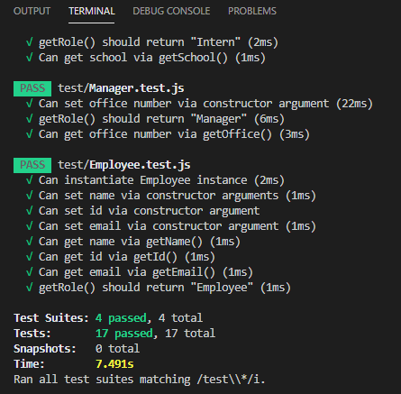
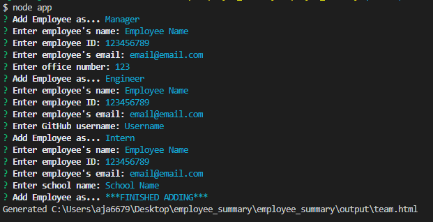
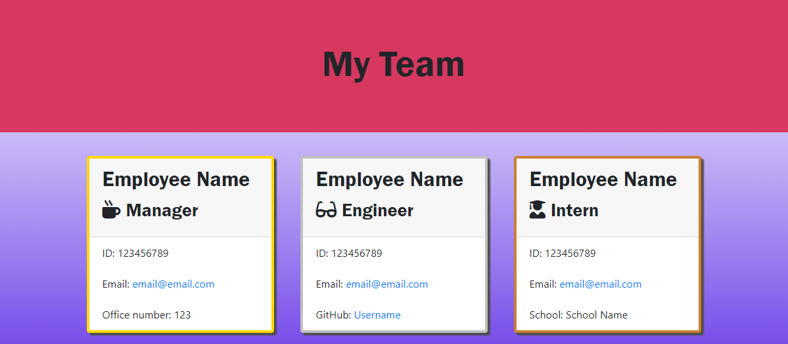

# Employee Summary

  ## Description:
  This program uses JavaScript to generate an html summary of team members which incorporates user prompted information.

  ## Links:
  * [Repo](https://github.com/locutusOO1/employee_summary)
  * [Video Walkthrough](https://drive.google.com/file/d/1w8jCrV3bVRs3pB3Q4VK7AbnG-0c_z_3U/view)

  ## Table of Contents:
  * [Installation](#installation)
  * [Usage](#usage)
  * [Technology Used](#technology-used)
  * [Questions](#questions)
  * [Screenshots](#screenshots)

  ## Installation:
  * Install dependencies by running "npm install" from the terminal.
  
  ## Usage:
  * Run tests from the terminal with "npm test"
  * Run application from the terminal with "node app"
  * Follow instructions from prompts to enter information for the team of employees
  * If successful, a new "team.html" file is created in the output directory

  ## Technology Used:
  * Node.js - for JS runtime environment
  * JEST - for testing
  * Inquirer - for user input with prompts
  * File Sytem - for file creation
  * JS/ES6+ - for program logic
  * HTML - for output layout
  * CSS - for output style
  * Bootstrap - for responsive design
  * Screencastify - for video walkthrough

  ## Questions:
  * Feel free to checkout my [GitHub Profile](https://github.com/locutusOO1).

  ## Screenshots:
  ### Test Example:

  

  ### CLI Example:

  

  ### HTML Output Example:

  
